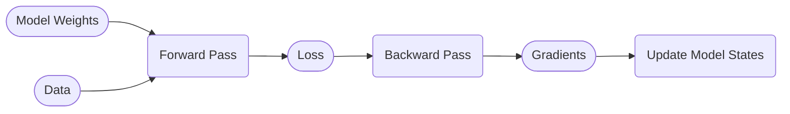
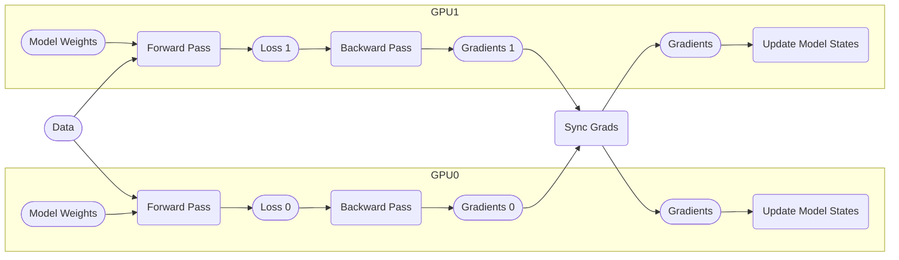
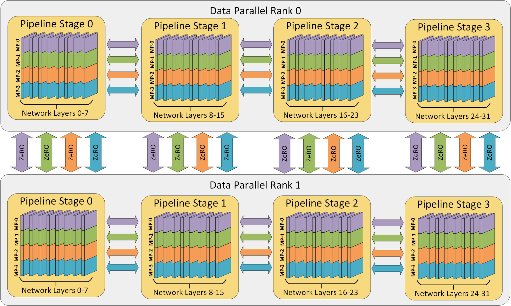
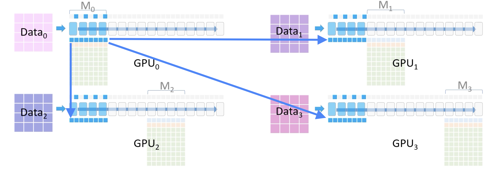
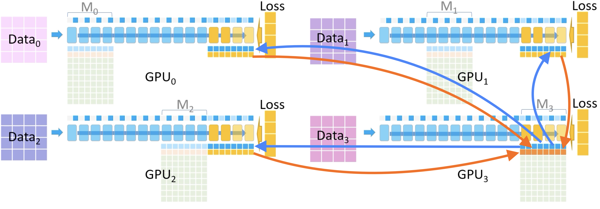
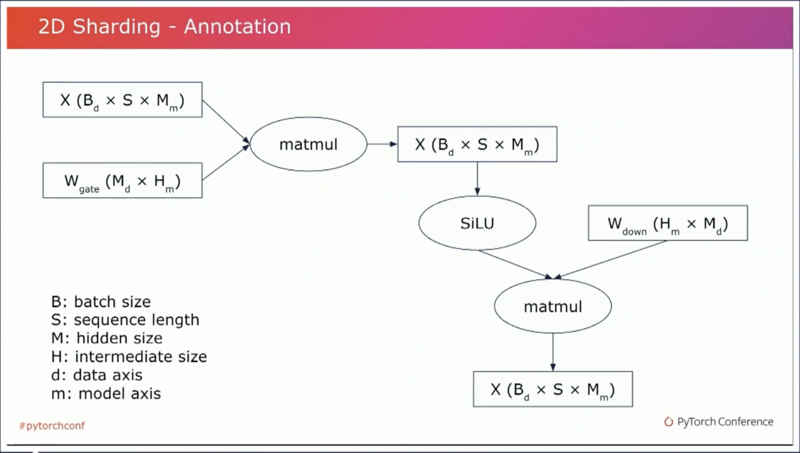
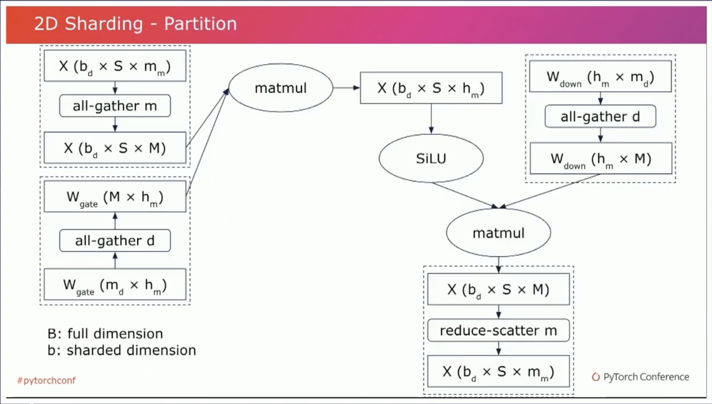

# Distributed Training for Machine Learning

In this blog post we introduce popular concepts and techniques used in distributed training for machine learning.

## Table of Contents
- [Why We Need Distributed Training](#why-we-need-distributed-training)
- [Collective Operations](#collective-operations)
- [Data Parallel and Pipeline Parallel](#data-parallel-and-pipeline-parallel)
- [Tensor Parallel](#tensor-parallel)
- [3D Parallelism](#3d-parallelism)
- [ZeRO](#zero)
- [FSDP](#fsdp)
- [GSPMD](#gspmd)
- [Further Readings](#further-readings)

## Why We Need Distributed Training

Scaling model size has been one of the most successful ways to improve model capabilities for the past 5 years.
However, this comes at the cost of scaling resources.
Recently, large language models require so much memory to run that many don't even fit on a single GPU, let alone training such models.
This situation calls for the need of training models with distributed systems to make training large models possible and faster.

## Collective Operations

Collective operations refer to the ways nodes in a distributed system collaboratively compute a result.
In this blog post, we will be talking about **all-reduce**, **reduce-scatter**, and **all-gather**.
This picture illustrates the operations perfectly:

> [Source](https://engineering.fb.com/2021/07/15/open-source/fsdp/)

## Data Parallel and Pipeline Parallel

Here's the diagram of a typical training step:

**Data parallel parallelizes data,** assigning each GPU node a different data batch.
GPU nodes synchronize gradients with an all-reduce operation to ensure model states consistency.  
Here's an example of DP (Data Parallelism) = 2:

**Pipeline parallel pipelines model layers,** assigning each GPU node a different set of layers.
Each GPU node serves as a pipeline stage, for example:

> [Source](https://openai.com/research/techniques-for-training-large-neural-networks)

Here's another example of PP (Pipeline Parallelism) = 2:

Comparing pipeline and data parallelism:

| | Data Parallel | Pipeline Parallel |
| :- | :- | :- |
| Split Target | Data | Model |
| Computation Granularity | Unchanged | Reduced |
| Communication Overhead | Increased | Increased More |
| Model States Distribution | Replicated | Partitioned |

OpenAI has a nice [blog post](https://openai.com/research/techniques-for-training-large-neural-networks) explaining pipeline parallelism.

## Tensor Parallel

Tensor parallel refers to parallelizing tensor computation across different nodes.
The most notable example is [Megatron-LM](https://arxiv.org/abs/1909.08053).
Megatron-LM partitions MLP layers along the column axis,
so matrix multiplications can be parallelized perfectly without any synchronization during computation.
Every node can get the final result with one all-reduce in the end by leveraging the block matrix property.

For self-attention layers, Megatron-LM parallelizes them along the head dimension.

> [Source](https://arxiv.org/abs/1909.08053)

## 3D Parallelism

3D parallelism employs all 3 types of parallelism (data, pipeline, and tensor), hence 3D.
When using 3D parallelism, users tune the configuration to maximize efficiency based on their compute cluster hardware specifications.  
Here's an illustration of configuration (DP, TP, PP) = (2, 4, 4),
taken from the great [blog post](https://www.microsoft.com/en-us/research/blog/deepspeed-extreme-scale-model-training-for-everyone/)
that explains 3D parallelism in-depth.

> Note on Model Parallelism:  
> As far as I understand, _model parallelism_ refers to any technique than parallelizes the model.  
> Pipeline parallelism is sometimes called model parallelism because it parallelizes the model layers.  
> Megatron-LM and the blog post above also refers to tensor parallel as model parallel
> because TP parallelizes the tensor computation of model layers.
> To avoid confusion, I refrain from using the term _model parallel_ in this blog post.

## ZeRO

ZeRO (Zero Redundancy Optimizer) is a technique that tries to perform data parallel with the memory usage of pipeline parallel.
Roughly speaking, ZeRO assigns each GPU node a unique set of model layers and optimizer states, and GPU nodes communicate data when needed.

Here's an example of 4 GPUs performing ZeRO, where $GPU_i$ consumes data batch $Data_i$ and holds model layers and optimizer states $M_i$.

In the forward pass of layer $M_0$, $GPU_0$ broadcasts model layer weights $M_0$ to all the other GPU nodes to perform data parallel computation.

In the backward pass of layer $M_3$, $GPU_3$ similarly broadcasts model layer weights $M_3$ to all the other GPU nodes
to perform data parallel computation.
Every GPU node computes local gradients with respect to their data batch,
and $GPU_3$ reduces all gradients to update $M_3$ layer weights and model states.

The images are taken from the animation in this
[excellent blog post](https://www.microsoft.com/en-us/research/blog/zero-deepspeed-new-system-optimizations-enable-training-models-with-over-100-billion-parameters/)
explaining ZeRO.  
For more details on the motivation, see the [paper](https://arxiv.org/abs/1910.02054).

> Note: The initial design of ZeRO only partitions optimizer states, which are never communicated, hence the name "zero redundancy."
> Technically, model layers are redundant when performing forward pass, so ZeRO stage 2 and 3 are no longer zero redundancy.

## FSDP

FSDP (Fully Sharded Data Parallel) is a technique developed by Meta's PyTorch team, which is heavily inspired by ZeRO.  
In ZeRO, the workload distribution is highly unbalanced when a GPU node performs broadcast and reduce, causing other nodes to idle.
FSDP mitigates this issue by sharding (partitioning) model states in a way that the collective operation has symmetrical workloads.

| | ZeRO | FSDP |
| :- | :- | :- |
| Model States Distribution Per Node | A set of layers | A shard of all layers |
| Forward Pass Collective Operation | Broadcast | All-gather |
| Gradient Accumulation | Reduce | Reduce-scatter |

In FSDP, gradient accumulation is equivalent to first reducing along the data axis and then scattering the shards to their corresponding GPU nodes.

The image is from this [blog post](https://engineering.fb.com/2021/07/15/open-source/fsdp/),
which I highly recommend reading to understand FSDP better.  
Designed by the PyTorch team, FSDP is well-integrated into PyTorch.
To learn more about the engineering details, see their published [paper](https://arxiv.org/abs/2304.11277).

## GSPMD

GSPMD is a compiler-based parallel system that is capable of all 3 parallism paradigms.  
Users specify the way they want a tensor to be sharded by giving **a mapping from device mesh axes to sharded tensor axes**.
A device mesh is a logical representation of the arrangement of accelerators.
For example, given a device mesh $(a, b, c) = (2, 3, 1)$ and a tensor of size $(A, B, C) = (1, 9, 4)$, if we map $a \to A, b \to B, c \to C$:

- Dimension $A$ is replicated, hence data parallelism
- Dimension $B$ is sharded, hence tensor parallelism

Representing pipeline parallelism with GSPMD is a little more intricate. Suppose we want to perform an $L$-stage pipeline:

- $L$ state tensors expressed as one $L \times \dots$ tensor
- GSPMD vectorizes $L$ computation stages, executes them in parallel, and right shifts the tensor after every iteration

Given the specification, the compiler inserts the collective operations accordingly.

Here's a real-life example of sharding annotation from a [lightning talk at the PyTorch conference](https://www.youtube.com/watch?v=tWH2MAHzVVc):

User annotation: ([Image source with timestamp](https://www.youtube.com/watch?v=tWH2MAHzVVc&t=635s))

XLA inserts collective operations ([Image source with timestamp](https://www.youtube.com/watch?v=tWH2MAHzVVc&t=721s))

For more information, this [blog post](https://irhum.github.io/blog/pjit/)
introduces `jax.pjit`, which uses GSPMD, and provides spectacular tensor sharding visualizations, which are very helpful with building intuitions.  
In addition, here's the [blog post version](https://pytorch.org/blog/pytorch-xla-spmd/) of the lightning talk,
a [blog post](https://pytorch.org/blog/high-performance-llama-2/) of how GSPMD is used to train LLaMa-2,
and the [paper](https://arxiv.org/abs/2105.04663) for the full details of compiler passes.

## Further Readings

Distributed training for ML involves the co-design of machine learning software and hardware.
One can go down the rabbit hole of distributed system design,
which I find Google's [Pathways](https://arxiv.org/abs/2203.12533)
and [Multislice](https://cloud.google.com/blog/products/compute/using-cloud-tpu-multislice-to-scale-ai-workloads) quite interesting.
On the GPU side there's [Project Fiddle](https://www.microsoft.com/en-us/research/project/fiddle/overview/),
a collection of papers about building efficient infrastructure for distributed ML systems.
Regarding software, [Adept's blog post](https://www.adept.ai/blog/sherlock-sdc) about silent data corruptions is a delightful read
and also comes with clear illustrations of the ring reduce algorithm (An algorithm that implements all-reduce).
Finally, I highly recommend [LLM Training Puzzles](https://github.com/srush/LLM-Training-Puzzles) by Sasha Rush,
a simulator that tests your understanding of distributed training algorithms.
