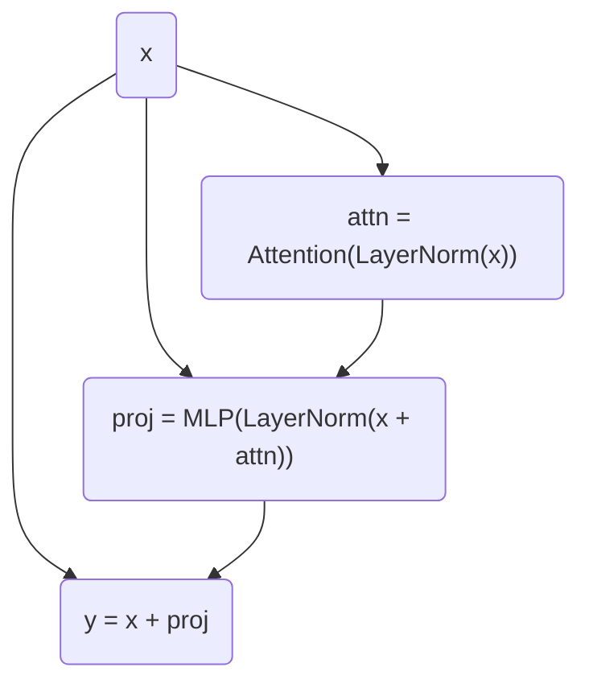
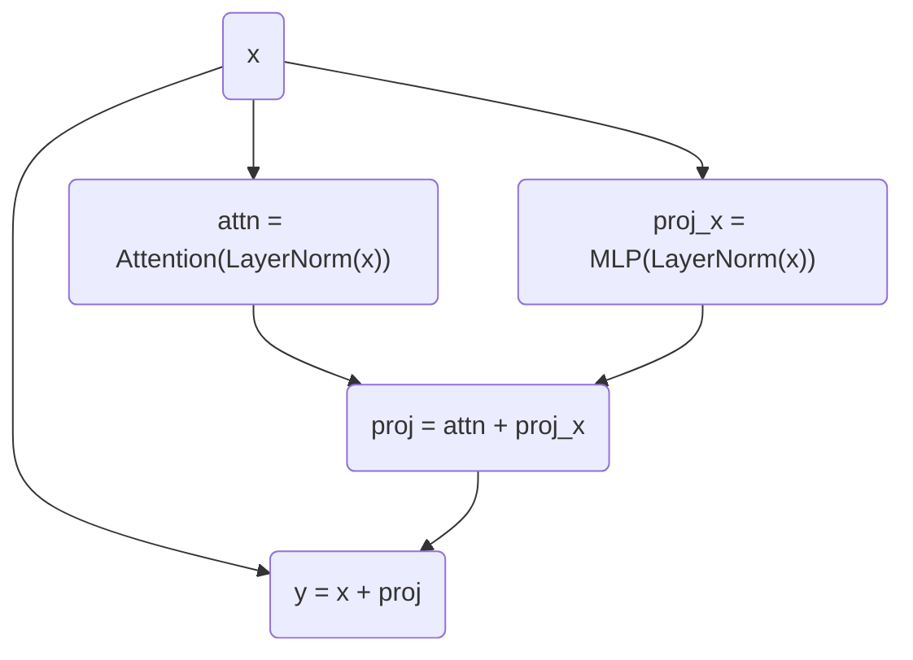

# PaLM

This post contains notes I took while reading the paper about Pathways Language Model (PaLM).  
[Arxiv Link](https://arxiv.org/abs/2204.02311v5)

PaLM is Google's language model family that focuses heavily on scaling up model parameters.
My impression is that the engineering feats behind such extreme scaling are amazing.

- [Model Architecture](#model-architecture)
  - [Parallel Layers](#parallel-layers)
  - [Multi-query Attention](#multi-query-attention)
- [Training Infrastructure](#training-infrastructure)
- [Bitwise Determinism](#bitwise-determinism)
- [Training Instability](#training-instability)
- [Further Readings](#further-readings)

## Model Architecture

PaLM uses the decoder-only style Transformer, adding a few tweaks with efficiency in mind.

### Parallel Layers

Instead of projecting the sum of attention and input:

We parallelize the attention and the MLP layers:

The paper states that this formulation increases training speed by 15% at large scales
because MLP and Attention operations _can be fused_.
Given that the whole point of this change is to parallelize MLP and Attention,
I suspect that it means the two operators can be fused with LayerNorm, not with each other.  
The authors also report that the change caused quality degradation at 8B scale but non at 62B scale,
which makes me curious that why LLaMA-2 considered multi-query attention but not this technique.

### Multi-query Attention

Multi-query attention is an attention variant that reduces key and value tensors to only 1 head.  
This reduces the number of weights needed to be loaded into the memory,
and it is especially beneficial for autoregressive decoding because
key and value tensors are repeatedly loaded for every token generation.  
The [multi-query attention paper](https://arxiv.org/abs/1911.02150)
explains the algorithim really well with the Einstein notation.
One thing to note that is $h$ stands for the head dimension in the PaLM paper
but stands for the number of heads in the original paper.  
A question I had was: Why don't we do multi-key or multi-vector instead?
Since both multi-key and multi-vector seem to be mathematically feasible,
I guess it is because multi-query retains model quality the best.  
[LLaMa-2](https://ai.meta.com/research/publications/llama-2-open-foundation-and-fine-tuned-chat-models/)
did ablations on different attention mechanisms, including multi-query (MQA), grouped-query (GQA), and multi-head (MHA).
Interestingly, the results were not as clear cut as I expected.
Under different batch size settings, MHA occasionally outperforms the other two in terms of throughput and latency.
However, MQA and GQA are able to run on larger batch sizes that is physically impossible for MHA.  
An interesting reason why LLaMa-2 uses GQA is that MQA cannot be sharded across the head dimension
since there is only 1 set of KV values,
but sharding across the batch dimension is complicated to deploy and is not worth doing when the batch size is small.

## Training Infrastructure

PaLM is implemented using JAX and T5X and trained on Google's [Pathways system](https://arxiv.org/abs/2203.12533).
Here is a breakdown of the hardware configuration:

- Each host is paired with 4 TPU v4 chips
- 768 hosts form a TPU v4 Pod, where $4 \times 768 = 3072$ TPU v4 chips are connected with fast interconnect
- PaLM 540B is trained on 2 TPU v4 Pods connected over Google's data center network

Pathways is designed to hide or amortize the cost of data transfer and program dispatch.
A challenge Pathways networking has to deal with is the need for high throughput for cross-pod data transfers.
PaLM is trained with 2-way pod-level data parallelism, i.e. each of the 2 TPU v4 Pod processes half of every input mini-batch.
After completing forward and backward passes, the 2 pods will exchange gradients and update their own weight copies.
Cross-pod gradient transfer is a very bursty workload because many hosts transfer their gradient simultaneously,
straining the data center network.

Pathways also employs a mixture of model and data parallelism (details mentioned in the paper [GSPMD](https://arxiv.org/abs/2105.04663)),
avoiding pipeline parallelism because of its low hardware utilization.

## Bitwise Determinism

The system is designed so that the team can produce a bitwise identical model checkpoint from any of its previous checkpoints.
This is achieved by JAX, XLA, T5X, and a deterministic data shuffling pipeline.  
Determinism is crucial to ensuring the service quality of deployed models,
and JAX's functionally pure design facilitates this property.
This also reminds me of ML hardware accelerator startup Groq's design, which also put great emphasis on determinism.

## Training Instability

The team encountered unexplainable loss spikes during training and worked around by rolling back and skipping a couple hundred batches.
According to their ablation experiments, the spike-inducing data batches occured with particular model parameter states.
This phenomenon is really interesting and I wished they had disclosed more details on this.

## Further Readings

One of most amazing aspects of PaLM is the model scaling, which is enabled by Pathways system and distributed training strategies.
I plan to read about Pathways, GSPMD for Google's parallelism techniques, and Megatron-LM for tensor parallelism.
Another thing worth checking out is PaLM 2, but as far as I can tell, the technical report does not include any system-related information,
but the scaling law experiments seem interesting.

- [PaLM 2](https://ai.google/static/documents/palm2techreport.pdf)
- [Pathways](https://arxiv.org/abs/2203.12533)
- [GSPMD](https://arxiv.org/abs/2105.04663)
- [Megatron-LM](https://arxiv.org/abs/1909.08053)
