# Tesla AI Day 2021 - Vision

In this article, I will summarize the Tesla AI Day technical deep dive of Tesla Vision, the vision component of Tesla Autopilot.
Moreover, I will try to gather everything referenced in the presentation, such as the mentioned research papers.
I also added timestamps of the presentation for each section .

## Table of Contents

- [Overview](#overview)
- [Neural Network Backbone](#neural-network-backbone)
  - [RegNets](#regnets)
  - [Multi-scale Feature Pyramid Fusion](#multi-scale-feature-pyramid-fusion)
- [Image-to-BEV Transform + Multi-cam Fusion](#image-to-bev-transform--multi-cam-fusion)
  - [Challenges](#challenges)
  - [Learning Where to Look](#learning-where-to-look)
  - [Results](#results)
- [Video Neural Net Architecture](#video-neural-net-architecture)
  - [Feature Queue](#feature-queue)
  - [Video Module](#video-module)
  - [Improvements](#improvements)
- [Multi-task Learning HydraNets](#multi-task-learning-hydranets)
  - [Task-specific Detection Heads](#task-specific-detection-heads)
  - [HydraNet](#hydranet)
- [Recap](#recap)
- [Improvement Opportunities](#improvement-opportunities)
  - [Late Time and Space Fusion](#late-time-and-space-fusion)
  - [Postprocessing Dense Rasters](#postprocessing-dense-rasters)
- [End Note](#end-note)

## Overview

> [timestamp](https://youtu.be/j0z4FweCy4M?t=2924)

Tesla Vision is a neural network that processes raw images and outputs the **vector space**.  
The **vector space** is a 3-dimensional representation of everything needed for driving,  
e.g. curbs, traffic signs, and positions of cars.

## Neural Network Backbone

Each of the 8 cameras captures 1280 x 960 12-Bit (HDR) images at 36 Hz, which are then fed into a feature extractor.  
Tesla Vision uses RegNets, a class of ResNets, as feature extractors.

### RegNets

> [timestamp](https://youtu.be/j0z4FweCy4M?t=3133)

RegNets offer a nice neural network design space that allows tradeoffs between latency and accuracy.  
RegNets are proposed in [_Designing Network Design Spaces by Radosavovic et al_](https://arxiv.org/abs/2003.13678).  
Here's a high-level description of what the paper is about:  
- A **network design space** is defined as a population of model architectures parameterized by certain aspects (e.g. network depth).
- The author proposes principles to come up with a design space that contains a high concentration of top-performing models.
  That is, _designing_ network design spaces.
- Concretely, the author progressively simplifies the design space (e.g. setting network depth to a certain number)
  based on insights gained from the statistics of _n_ sampled models.
- The author applied the methodology to ResNets and designed RegNets, which work well under different compute power limits.

### Multi-scale Feature Pyramid Fusion

> [timestamp](https://youtu.be/j0z4FweCy4M?t=3175)

The backbone outputs a number of features at different scales with different purposes:

| Resolution | Channel counts |             Neuron behavior              |
| ---------- | -------------- | ---------------------------------------- |
|    High    |      Low       | Scrutinize image details                 |
|    Low     |      High      | See the whole image and have the context |

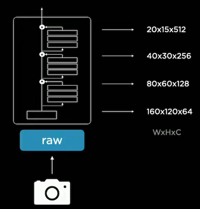

A feature pyramid network is then used to process the multi-scale features.  
The network gets features of different scales to communicate effectively and share information.  
For instance, the neural network leverages context and details to detect the car.

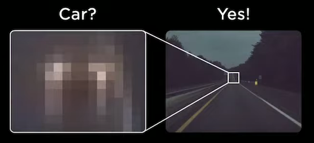

Tesla Vision uses BiFPN, proposed in
[_EfficientDet: Scalable and Efficient Object Detection by Tan et al_](https://arxiv.org/abs/1911.09070).
BiFPN is a feature pyramid network focused on efficiency, and here I summarize its main features:

- Efficient Cross-scale Connections: Nodes that have only one input edge are removed based on the intuition that
  single-input nodes contributes less to feature fusion.
  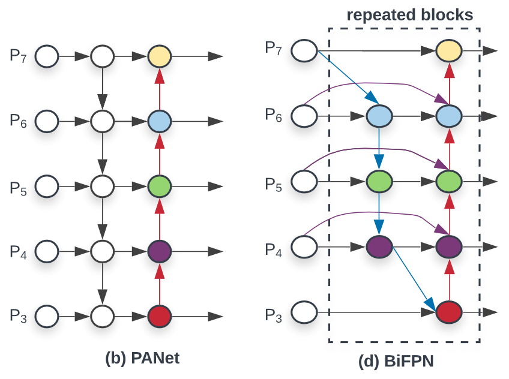
- Fast Normalized Feature Fusion: Additional weight for each input is added,
  which lets the network learn the importance of each feature. To improve training stability,
  the author proposes a weight normalization approach that is much more efficient than softmax operation.

## Image-to-BEV Transform + Multi-cam Fusion

Driving is done on the vector space, so image space predictions need to be casted into a bird's eye view (BEV).
However, the team faced some challenges when trying to do so.

### Challenges

#### Depth Prediction Inconsistency

> [timestamp](https://youtu.be/j0z4FweCy4M?t=3420)

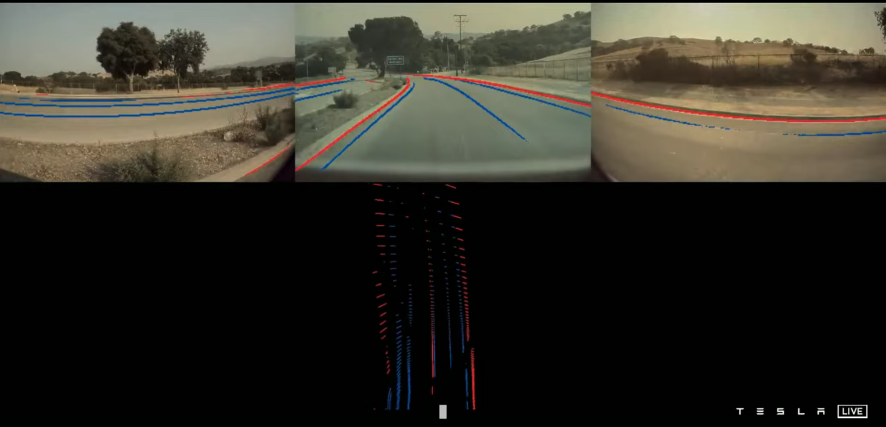

Image space predictions look great, but once they are casted into the vector space, predictions look terrible.  
The reason is that decent vector space predictions require **accurate depth predictions in every pixel**.
What makes it even more difficult is that cameras may be occluded, creating inconsistency in predictions.

#### Object Detection Inconsistency

> [timestamp](https://youtu.be/j0z4FweCy4M?t=3466)

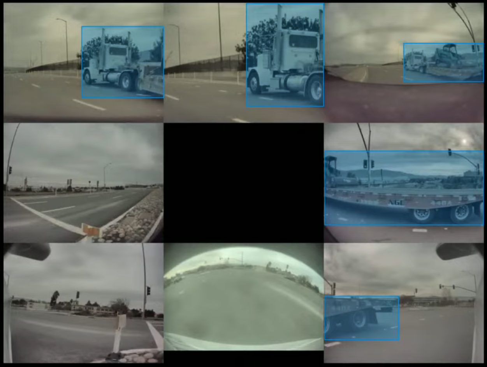

When an object spans across multiple cameras (In this case, 5 out of 8 cameras),
it is difficult to fuse measurements of multiple images predictions,
causing incoherent vector space predicitons.

#### Variations in Camera Calibration

> [timestamp](https://youtu.be/j0z4FweCy4M?t=3693)

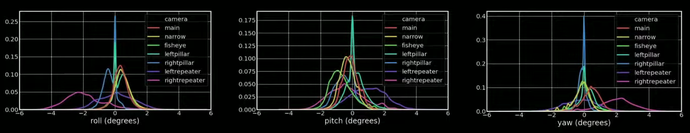

All of the cars are slightly cockeyed in a different way.
For instance, the camera calibration of a pillar camera varies from car to car.
The figure above shows the distribution of camera calibrations in the fleet.
To do image-to-BEV transforms, camera calibration is needed.

### Learning Where to Look

To tackle these problems, the team designed the neural network such that it **directly makes predictions in vector space**.  
The neural network needs to do 2 things:

- Transform image space features to BEV features.
- Fuse information from different cameras, i.e. for every position in the vector space,
  learn where (in the image space) to look for information.

#### Rectifying to a Common Virtual Camera

> [timestamp](https://youtu.be/j0z4FweCy4M?t=3710)

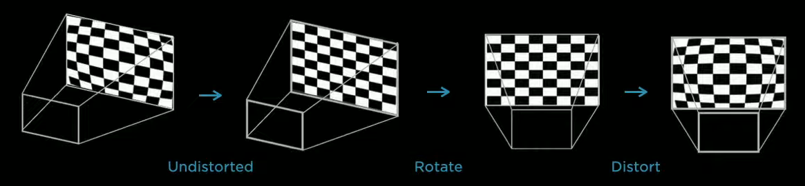

All of the images are transformed into a common virtual camera using a special rectification transform.
This improves the data quality of fused images.
For instance, below is the average of all images captured by repeater cameras on a car.

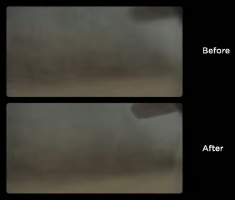
Notice how the back mirror at the upper right gets crisper.

---

Regarding the neural network, the architecture used is Transformer,
proposed in [_Attention Is All You Need by Vaswani et al_](https://arxiv.org/abs/1706.03762).
Specifically, one or more multi-head self-attention blocks is used.

> [timestamp](https://youtu.be/j0z4FweCy4M?t=3555)

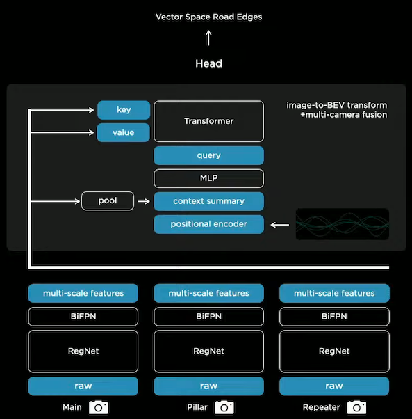

#### Query Vectors

A raster of the size of the output space is tiled with positional encodings of the output space.  
Positional encoding is information about the position of every element in the raster,
which is represented using sine and cosine functions.  
These are then encoded with an MLP into a set of query vectors.

#### Attention

Image features from each camera creates a key and value vector.  
Keys and queries interact multiplicatively to compute the correlation between every key-query pair.
That is, the neural network is **learning what features are important / to attend to a given certain query**.
Here's an example:
- A key vector is created from image features of the pillar camera, containing information about location and what it sees.
- A query vector is asking for a certain type of feature at some position of the output space.

### Results

> [timestamp](https://youtu.be/j0z4FweCy4M?t=3755)

After doing all the engineering correctly, which is extremely difficult, the neural network performs drastically better.  
For instance, there results of curb line detection in the vector space are like night and day.
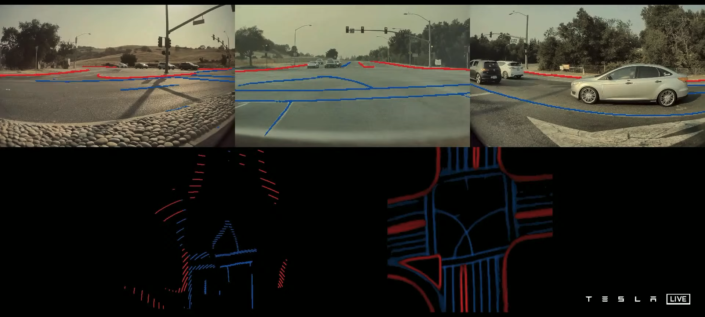

Object detection is also improved, especially for large objects.
Here we can see that the multi-camera setup (blue bounding boxes) predicts the truck a lot more accurately.
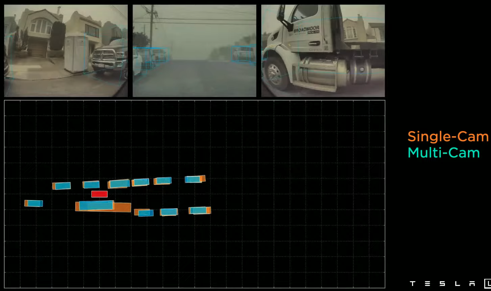

## Video Neural Net Architecture

Many predictions require not only information of static images but also **video context**.
For example, it is impossible to predict an vehicle's velocity based on a single image. 
Thus, the neural network needs _memory_ for remembering what happened in order to deduce new information.  

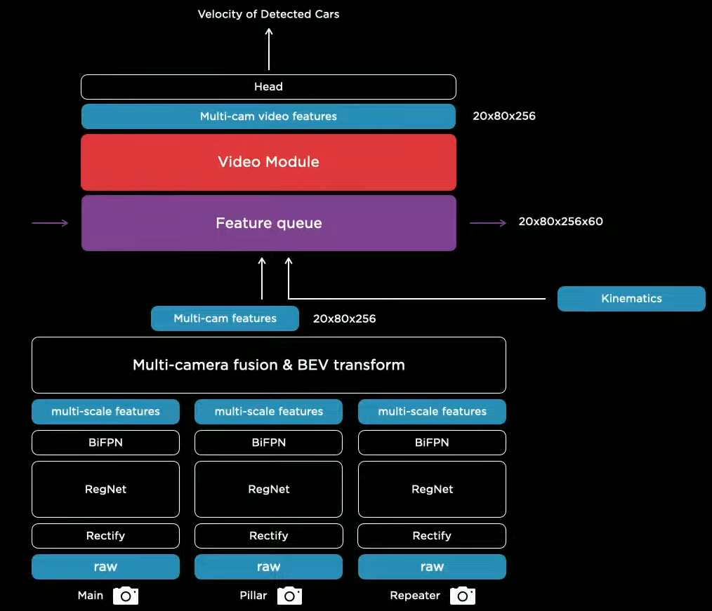

The team converged on this solution, which includes a feature queue and a video module.
- Feature queue caches features over time.
- Video module fuses the cached features temporally.
- Kinematics, e.g. the car's own velocity and acceleration, is inserted to keep track of how the car has traveled.

### Feature Queue

> [timestamp](https://youtu.be/j0z4FweCy4M?t=3894)

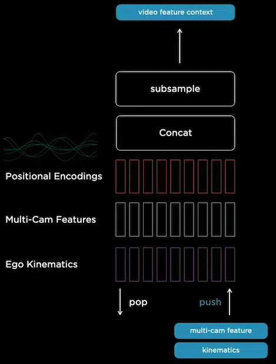

Each element in the feature queue is a concatenation of multi-cam features, kinematics, and positional encodings
(My interpretation of positional encoding is that it contains the information of the order a feature is pushed).  
Two types of queues are used based on different rules of **when to push**.

- **Time-based queue**: Push periodically, e.g. every 27 milliseconds.
  This gives the neural network the ability to detect occluded objects by referencing previous features.
- **Space-based queue**: Push every time the car travels a certain distance, e.g. every 1 meter.
  Time-based queue may discard important information that occured a long time ago,
  e.g. line markings and signs may be forgotten after the car waits for a long red light.
  Thus, a space-based queue is used to store spatially temporal information.

### Video Module

> [timestamp](https://youtu.be/j0z4FweCy4M?t=4028)

_Spatial Recurrent Neural Networks_ are used to temporally fuse information.

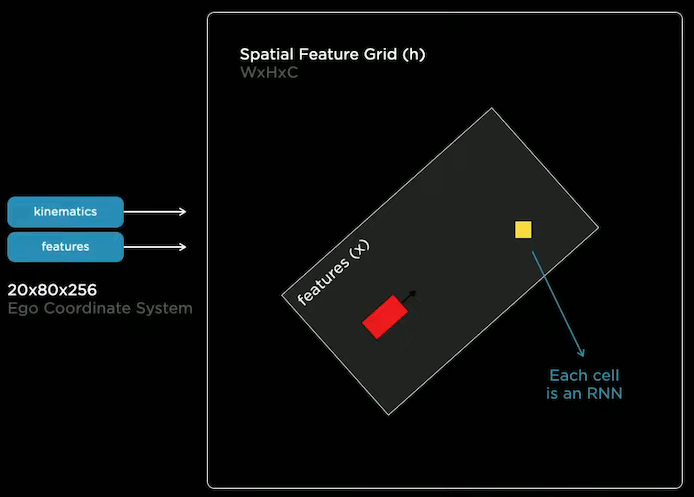

RNN cells are organized as a 2D lattice, representing the two-dimensional surface we drive on.
Hidden states of the cells are updated only when the car is nearby or has visibility.
Concretely, as the car is driving around, the kinematics is used to integrate the car's position into the hidden feature grid.

Here is the visualization of some channels of the hidden feature grid:

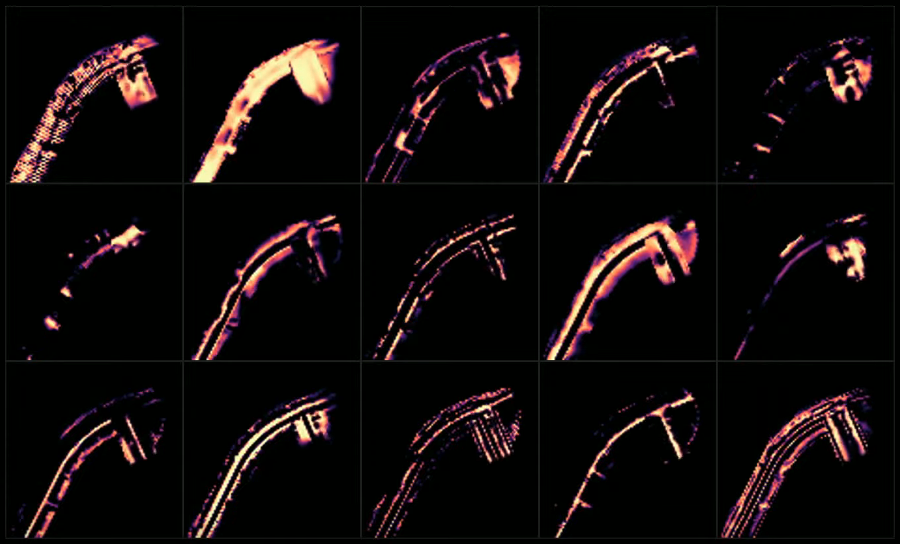

We can see that each channel is keeping track of different aspects of the road, e.g. edges and the road surface.
Consider watching the visualization in the presentation video because the visualization is actually dynamic.
[Here's the link.](https://youtu.be/j0z4FweCy4M?t=4070)

Spatial RNN effectively gives the neural network to **selectively read and write information to the memory**.

### Improvements

#### Temporary Occlusion

> [timestamp](https://youtu.be/j0z4FweCy4M?t=4175)

The video neural network improved object detection's robustness to temporary occlusion.

When the car is occluded, the video neural network (blue) retains detection.
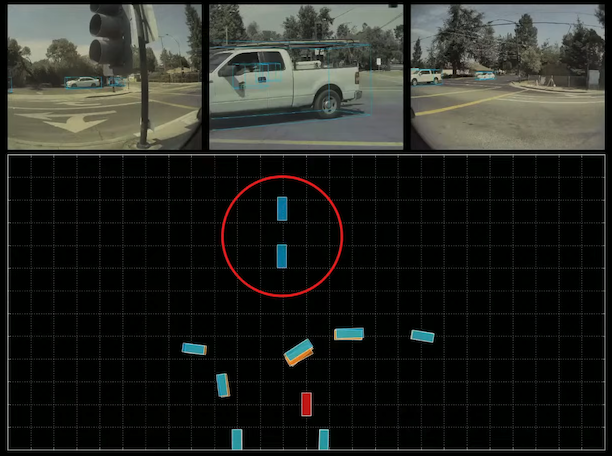

When the car is partially occluded, the single-frame neural network (orange)
makes terrible predictions based on incomplete information,
whereas the video neural network (blue) knows to discard the current occluded scene.
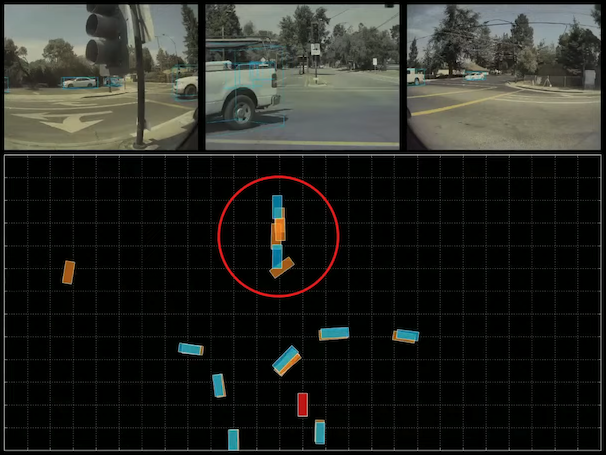

#### Depth and Velocity

> [timestamp](https://youtu.be/j0z4FweCy4M?t=4237)

Video neural network also improved depth and velocity prediction.

Below is a comparison of depth (upper column) and velocity (lower column) prediction.  
We can see that the video neural network (blue) performs on par with radar signals (green),
while the single-frame network (orange) struggles to predict depth accurately enough to produce decent velocity prediction.

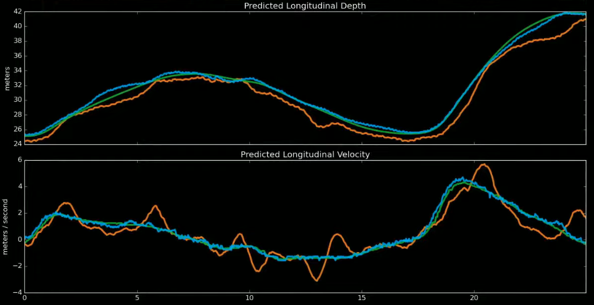

## Multi-task Learning HydraNets

### Task-specific Detection Heads

> [timestamp](https://youtu.be/j0z4FweCy4M?t=3199)

The video features are then fed into a number of detection heads, which are one-stage, YOLO-like detectors.
A prediction contains:
- A raster with 1 bit per position that indicates whether there is an object (e.g. a car)
- If there is an object, output its additional attributes (e.g. car type)

### HydraNet

> [timestamp](https://youtu.be/j0z4FweCy4M?t=3227)

The architecture has a common backbone and branches off to multiple detection tasks, which is why it is named _HydraNet_.
HydraNet provides a number of benefits:
1. Amortized forward pass inference at test time because of feature sharing
1. De-couples tasks so that tasks can be fine-tuned individually
1. Backbone features can be cached to disk and used for fine-tuning

A typical training workflow would be like this:
1. End-to-end training: Train everything jointly
1. Cache multi-scale features
1. Fine-tune off of those feature for each task

## Recap

> [timestamp](https://youtu.be/j0z4FweCy4M?t=4279)

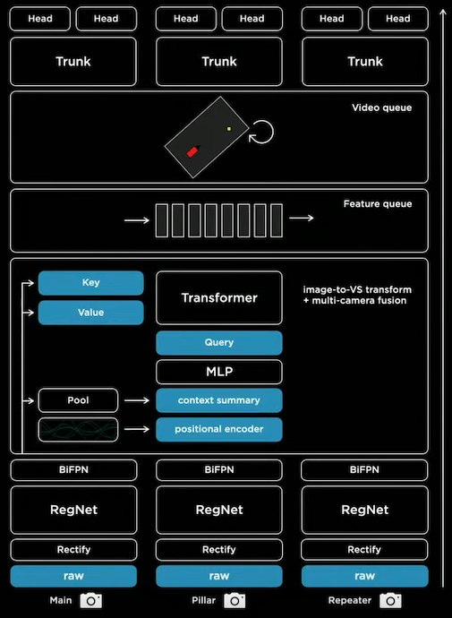

- Raw images go through **rectification** layer to transform to a common virtual camera.
- Rectified images pass through **RegNets** to process features at different scales.
- Multi-scale features are fused by a **BiFPN**.
- The fused features are fed into a **Transformer** to rerepresent it in the vector space.
- Vector space features are pushed into **feature queues** based on time and space.
- Features in the queues are processed by a **spatial RNN video module**.
- The processed features are passed into the trunks of the **HydraNet** for detection tasks.

## Improvement Opportunities

> [timestamp](https://youtu.be/j0z4FweCy4M?t=4337)

### Late Time and space Fusion

Time and space fusion occurs at nearly the end of inference.
Thus, video module and image feature extractors can be replaced with earlier fusion networks, e.g. optical flow networks.
Optical flow is the pixel-wise motions between consecutive images.  
Cost volume is also mentioned. Here's a basic explanation:
- Cost is a measurement of the disparity between the two image pixels at the same location.
- When the cost of a pixel in an _H x W_ image is represented as a vector of size _L_,
  the cost spans a volume of _H x W x L_, hence the name.

### Postprocessing Dense Rasters

The neural network outputs are dense rasters, which are costly to postprocess.
This is not ideal because the neural network is under strict latency requirements.
The team is looking into ways of predicting just the sparse structure of the road.

## End Note

I really like how Andrej Karpathy, Sr. Director of AI at Tesla, explains the design choices with problems.
In addition, I noticed the emphasis on efficiency: RegNets and BiFPN are all architectures that focus on efficiency.
Thank you for reading this long article, I hope you enjoyed it.
