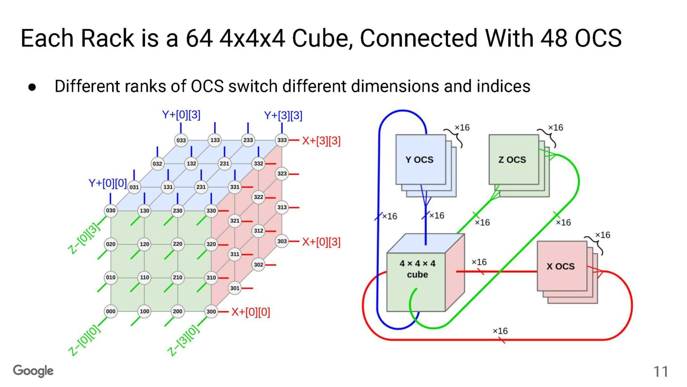
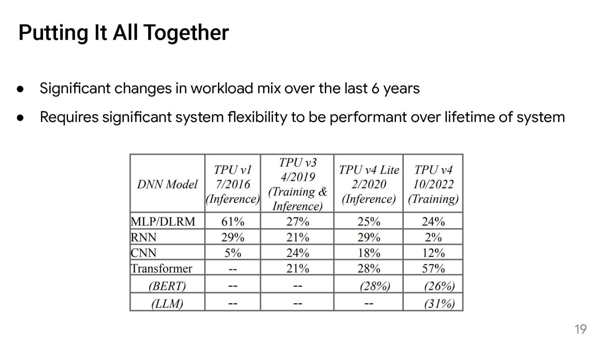
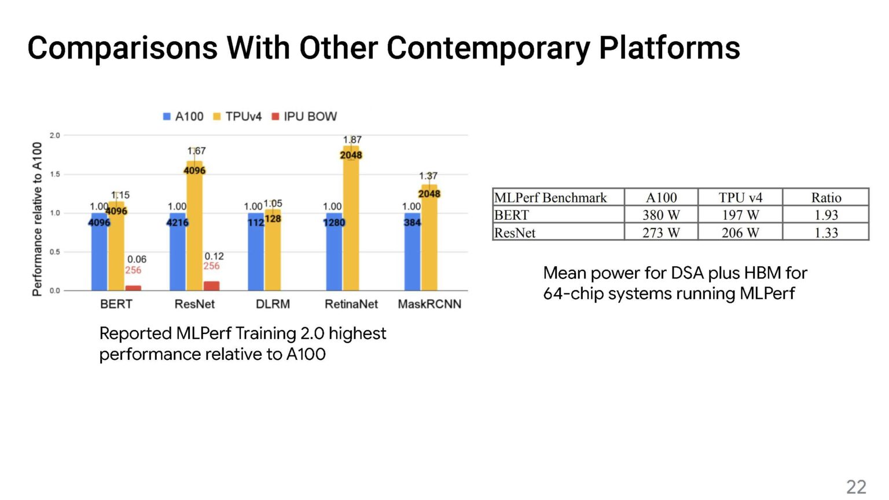

# TPU v4 and TPU v5e

## Links

- [TPU v4 paper](https://arxiv.org/abs/2304.01433)
- [Serve The Home @ Hot Chips 2023](https://www.servethehome.com/google-details-tpuv4-and-its-crazy-optically-reconfigurable-ai-network/)
- [TPU v5e Google Cloud Announcement](https://cloud.google.com/blog/products/compute/announcing-cloud-tpu-v5e-and-a3-gpus-in-ga)
- [Multi-slice](https://cloud.google.com/blog/products/compute/using-cloud-tpu-multislice-to-scale-ai-workloads)
- [Blog post](https://ai.meta.com/blog/dlrm-an-advanced-open-source-deep-learning-recommendation-model/)

## Notes

Each rack is a 4x4x4 cube of TPU nodes, connected with electrical direct attached cables (DACs).
Inter-rack communication uses optical circuit switches (OCS), and each rack comes with 16 OCS in each axis (48 total per rack).

**Goodput**: Measurement of application-level throughput, excluding protocol overheads and retransmitted data packets.
[Wikipedia](https://en.wikipedia.org/wiki/Goodput)

In terms of workload change, it's surprising that MLP models hold up better than CNNs.

I wonder why TPU v4 outperforms A100 more on CNN compared to BERT and DLRM.
That said, TPU is improves on power efficiency more on BERT compared to CNNs.

DLRM is a MLP-based recommendation model designed by Meta in 2019
([Blog post](https://ai.meta.com/blog/dlrm-an-advanced-open-source-deep-learning-recommendation-model/)).
It seems to be an production-grade model, so it would emphasize more on efficiency.
Might read it some time in the future.

[Multi-slice](https://cloud.google.com/blog/products/compute/using-cloud-tpu-multislice-to-scale-ai-workloads)
is a technology that allows a training run use TPUs in different TPU Pods.
A TPU slice means a fractional portion of TPUs in a TPU Pod, hence multi-slice.
It's worth writing a separate post about how multi-slice works.
