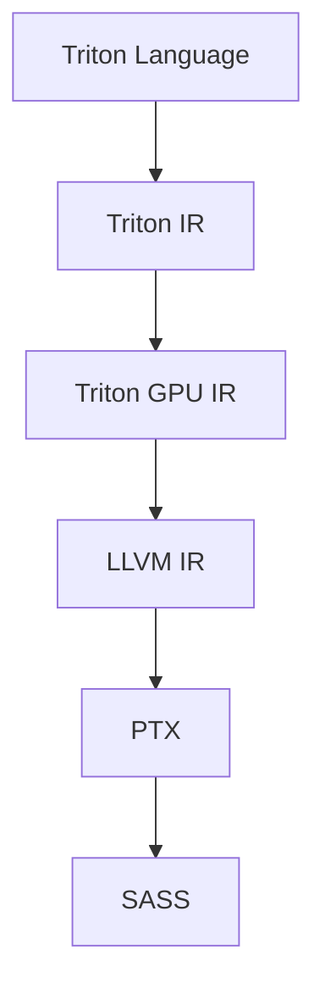

# Triton

Triton is a domain-specific language for writing high-performance deep learning kernels.

# Why Triton: The Performance Flexibility Trade-off

Deep learning algorithms are resource-intensive, so researchers need efficient implementations of their ideas to verify their algorithms' capabilities.
This is usually done by implementing specialized GPU kernels, 
but GPU programming requires a lot of knowledge about GPU architecture and familiarity with low-level programming.
This increases the development time and in worse case limits the researchers' ability to explore more unconventional algorithms
(i.e. [the hardware lottery](https://github.com/kimbochen/md-blogs/tree/main/the-hardware-lottery)).  
Triton offers a programming model that is simpler than common GPU ones, e.g. CUDA, but has more control than deep learning frameworks,
all the while leveraging a compiler to achieve the performance of highly-tuned low-level GPU kernel implementations.

# Programming Model

Here we use CUDA as our GPU programming model.
CUDA organizes memory and compute in a hierarchical fashion.
Programmers define what the smallest compute unit (a thread) does while managing memory (coalescing, shared memory) and
the scheduling of higher compute abstractions (i.e. block and grid).
Triton automates memory management and threads within a block,
allowing programmers to write vectorized code at the block-level abstraction and control block scheduling.

> For those unfamiliar with CUDA, the hierarchy from low to high is: Thread -> Block -> Grid

| | CUDA | Triton |
| :- | :- | :- |
| Memory Coalescing | Manual | Automatic | 
| Shared Memory Management | Manual | Automatic | 
| Block Scheduling | Manual | Automatic | 
| Grid Scheduling | Manual | Automatic | 

Source: [OpenAI Triton Blog post](https://openai.com/research/triton)

# Compiler Architecture

Triton's compiler leverages the MLIR compiler framework, modularizing optimization passes and targeting new hardware in the future.

Source: [PyTorch Lightning Talk: Triton Compiler - Thomas Raoux, OpenAI](https://www.youtube.com/watch?v=AtbnRIzpwho)

## Triton IR

Triton IR describes tile-level operations, i.e. tensor operations.
Triton IR uses data-flow analysis to resolve tensor shapes and [Predicated SSA form](https://cseweb.ucsd.edu/~calder/papers/PACT-99-PSSA.pdf)
to support control flow.  
For machine-independent optimization passes, Triton IR performs data pre-fetching, peephole optimization, function inlining, and more.
Peephole optimization refers to replacing tensor operations to simpler but equivalent ones, e.g. identity $X$ can replace $(X^T)^T$.
The paper mentions diagonal tensor properties can also be exploited in the future, I wonder what can be done.

## Triton GPU IR

# PyTorch 2 Integration

# Conclusion

# References

- [OpenAI Triton Blog post](https://openai.com/research/triton)
- [Original Paper - Triton: An Intermediate Language and Compiler for Tiled Neural Network Computations](https://www.eecs.harvard.edu/~htk/publication/2019-mapl-tillet-kung-cox.pdf)
- [PyTorch Lightning Talk: Triton Compiler - Thomas Raoux, OpenAI](https://www.youtube.com/watch?v=AtbnRIzpwho)
