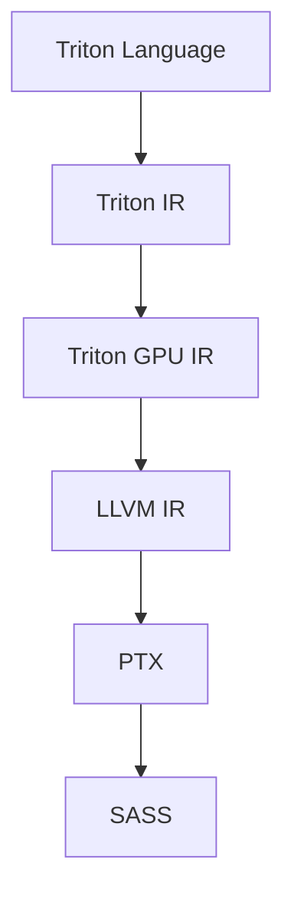
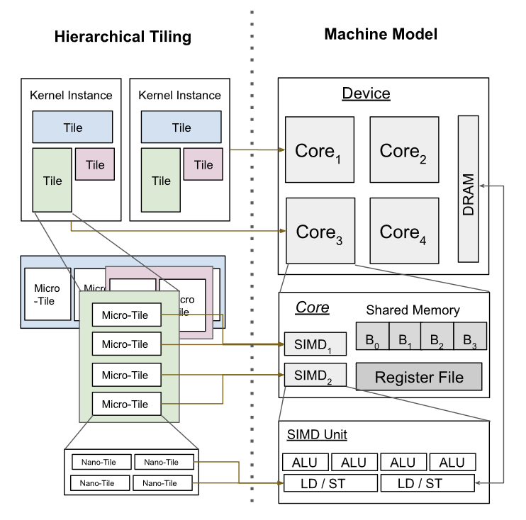

# Triton

Triton is a domain-specific language for writing high-performance deep learning kernels.

## Why Triton: The Performance Flexibility Trade-off

Deep learning algorithms are resource-intensive, so researchers need efficient implementations of their ideas to verify their algorithms' capabilities.
This is usually done by implementing specialized GPU kernels, 
but GPU programming requires a lot of knowledge about GPU architecture and familiarity with low-level programming.
This increases the development time and in worse case limits the researchers' ability to explore more unconventional algorithms
(i.e. [the hardware lottery](https://github.com/kimbochen/md-blogs/tree/main/the-hardware-lottery)).  
Triton offers a programming model that is simpler than common GPU ones, e.g. CUDA, but has more control than deep learning frameworks,
all the while leveraging a compiler to achieve the performance of highly-tuned low-level GPU kernel implementations.

## Programming Model

Here we use CUDA as our GPU programming model.
CUDA organizes memory and compute in a hierarchical fashion.
Programmers define what the smallest compute unit (a thread) does while managing memory (coalescing, shared memory) and
the scheduling of higher compute abstractions (i.e. block and grid).
Triton automates memory management and threads within a block,
allowing programmers to write vectorized code at the block-level abstraction and control block scheduling.

> For those unfamiliar with CUDA, the hierarchy from low to high is: Thread -> Block -> Grid

| | CUDA | Triton |
| :- | :- | :- |
| Memory Coalescing | Manual | Automatic | 
| Shared Memory Management | Manual | Automatic | 
| Block Scheduling | Manual | Automatic | 
| Grid Scheduling | Manual | Manual | 

Source: [OpenAI Triton Blog post](https://openai.com/research/triton)

## Compiler Architecture

Triton's compiler leverages the MLIR compiler framework, modularizing optimization passes and targeting new hardware in the future.

Source: [PyTorch Lightning Talk: Triton Compiler - Thomas Raoux, OpenAI](https://www.youtube.com/watch?v=AtbnRIzpwho)

### Triton IR

Triton IR describes tile-level operations, i.e. tensor operations.
Triton IR uses data-flow analysis to resolve tensor shapes and [Predicated SSA form](https://cseweb.ucsd.edu/~calder/papers/PACT-99-PSSA.pdf)
to support control flow.  
For machine-independent optimization passes, Triton IR performs data pre-fetching, peephole optimization, function inlining, and more.
Peephole optimization refers to replacing tensor operations to simpler but equivalent ones, e.g. identity $X$ can replace $(X^T)^T$.
The paper mentions diagonal tensor properties can also be exploited in the future, I wonder what can be done.

### Triton GPU IR

Triton GPU IR is where the machine-dependent optimization passes happen.
Machine-dependent optimization passes are mostly about data layout,
including hierarchical tiling, memory coalescing, and shared memory allocation.

#### Hierarchical Tiling and Memory Coalescing

> Source: [Original Paper](https://www.eecs.harvard.edu/~htk/publication/2019-mapl-tillet-kung-cox.pdf)

This optimization specifies data layout in every memory hierarchy to fit the hardware's resource as tightly as possible.
The author claims that Triton is able to enumerate configurations and optimize without the need of polyhedral machinery.
I wonder how this is achieved and would love to investigate more.

Memory coalescing is one of the optimization constraints of hierarchical tiling.
Because of the GPU hardware architecture, adjacent threads accessing nearby memory locations would reduce the memory latency.
This technique is called memory coalescing (_coalesce: combine elements in a mass or whole_).
The Triton compiler would order the threads within a tile so that they perform coalesced memory accesses whenever possible.

#### Shared Memory Allocation and Synchronization

Cooperating threads can access a common unit of fast shared memory.
Shared memory can reduce memory access time when operations would repeatedly access the same piece of data.
Triton first analyzes how long each variable of interest are used, and 
applies [a storage allocation algorithm](https://dl.acm.org/doi/pdf/10.5555/314500.315082)
to determine when and where to store those variables.  
Cooperating threads need an explicit synchronize barrier to avoid data race issues.
Triton automatically inserts barriers by detecting data hazards (read-after-writes and write-after-reads) with data-flow analysis.

## PyTorch 2.0 Integration

PyTorch 2.0 introduced a compiler stack, from TorchDynamo (Python to PyTorch's IR) to TorchInductor (PyTorch's IR to codegen).
Triton is integrated with TorchInductor and is the default codegen for GPUs.
The PyTorch compiler stack leverages Triton to generate generic kernels with function inlining and operator fusion.
Using Triton with TorchInductor offers decent speedups for model training and inference.
Function inlining and operator fusion are the optimizations that provide the most speedup,
which is in line with what I learned about ML compilers ([My ML compiler post](https://github.com/kimbochen/md-blogs/tree/main/graph-compilers).  

| | Inference | Training |
| -: | :- | :- |
| All TorchInductor Optimizations | 1.91 $\times$ | 1.45 $\times$ |
| No fusion | 1.68 $\times$ (-0.23) | 1.27 $\times$ (-0.18) |
| No inlining | 1.58 $\times$ (-0.33) | 1.31 $\times$ (-0.14) |
| No fusion and no inlining | 0.8 $\times$ (-1.11) | 0.59 $\times$ (-0.86) |

> Geomean speedup over PyTorch eager on 45 HuggingFace FP16 models.
> Source: [Triton Conference: PyTorch 2.0 and TorchInductor](https://www.youtube.com/watch?v=p13HpZv2S3Q)

However, highly-tuned libraries like cuBLAS still outperforms Triton by a decent margin for small Transformer models.
The author explains that cuBLAS is able to apply [3D matmul algorithms](https://ieeexplore.ieee.org/stamp/stamp.jsp?tp=&arnumber=5389455)
to provide more parallelism.  
For more information on the PyTorch compiler stack, see this [terrific slide deck by Keren Zhou](https://www.jokeren.tech/slides/Triton_bsc.pdf)
or [my blog post](https://github.com/kimbochen/md-blogs/tree/main/pytorch-systems-intro#pytorch).

## Further Readings

Triton is a domain-specific language for GPU programming that automates memory and thread block management
while offering highly-tuned library performance.
I wonder if Triton could support scheduling across multiple GPUs in the future,
given the trend of training and deploying large language models.

- [Here](https://www.jokeren.tech/slides/triton_intel.pdf) is a great introduction to Triton by Keren Zhou.
- [Here](https://superjomn.github.io/posts/triton-mlir-publish/) is an overview of the Triton compiler architecture after Triton migrated to MLIR
  (Caveat: It is written in Chinese).
- [Here](https://docs.nvidia.com/cuda/parallel-thread-execution/) is the documentation of the CUDA ISA.

## References

- [OpenAI Triton Blog post](https://openai.com/research/triton)
- [Original Paper - Triton: An Intermediate Language and Compiler for Tiled Neural Network Computations](https://www.eecs.harvard.edu/~htk/publication/2019-mapl-tillet-kung-cox.pdf)
- [PyTorch Lightning Talk: Triton Compiler - Thomas Raoux, OpenAI](https://www.youtube.com/watch?v=AtbnRIzpwho)
- [Triton Conference: PyTorch 2.0 and TorchInductor](https://www.youtube.com/watch?v=p13HpZv2S3Q)
- [Algorithms for Compile-Time Memory Optimizations](https://dl.acm.org/doi/pdf/10.5555/314500.315082)
- [A three-dimensional approach to parallel matrix multiplication](https://ieeexplore.ieee.org/stamp/stamp.jsp?tp=&arnumber=5389455)
- [Towards Agile Development of Efficient Deep Learning Operators - Keren Zhou](https://www.jokeren.tech/slides/triton_intel.pdf)
- [Technical Review on PyTorch 2.0 and Triton](https://www.jokeren.tech/slides/Triton_bsc.pdf)
