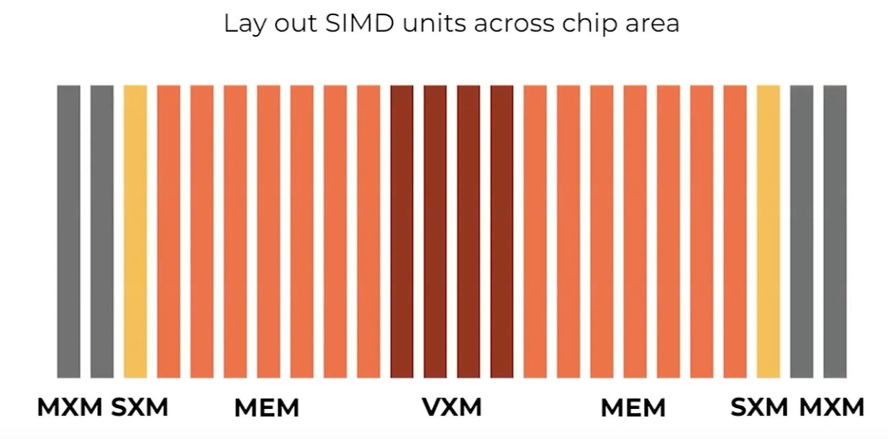

# Tweets

Putting my new Tweets here in case Twitter really disappeared.

## Table of Contents

- [Würstchen](#würstchen)
  - [What are the efficiency gains?](#what-are-the-efficiency-gains?)
  - [How did they manage to attain them?](#how-did-they-manage-to-attain-them?)
  - [What are the efficiency gains?](#what-are-the-efficiency-gains?)
  - [How did they manage to attain them?](#how-did-they-manage-to-attain-them?)
  - [How is training an additional model saving resources?](#how-is-training-an-additional-model-saving-resources?)
  - [Model performance?](#model-performance?)
- [Mixtral of Experts](#mixtral-of-experts)
  - [How does it perform compared to other models?](#how-does-it-perform-compared-to-other-models?)
  - [What does its MoE arch look like?](#what-does-its-moe-arch-look-like?)
  - [What did the team do differently so that Mixtral works?](#what-did-the-team-do-differently-so-that-mixtral-works?)
  - [Routing analysis: How does Mixtral decide the routing of its tokens?](#routing-analysis-how-does-mixtral-decide-the-routing-of-its-tokens?)
  - [Probability of an expert being the first or second choice?](#probability-of-an-expert-being-the-first-or-second-choice?)
- [Aespa - Post-Training Quantization of Hyper-Scale Transformers](#aespa---post-training-quantization-of-hyper-scale-transformers)
  - [What improvements does aespa bring?](#what-improvements-does-aespa-bring?)
  - [What is the method design that brings the improvements?](#what-is-the-method-design-that-brings-the-improvements?)
  - [Separate quantization costs more time. How does aespa overcome this?](#separate-quantization-costs-more-time-how-does-aespa-overcome-this?)
  - [How does it compare with other PQT schemes?](#how-does-it-compare-with-other-pqt-schemes?)
  - [Comparison with zero-shot quantization](#comparison-with-zero-shot-quantization)
  - [End notes](#end-notes)
- [Aya](#aya)
  - [Released data](#released-data)
  - [How data composition impacts task perf (5.6.1)](#how-data-composition-impacts-task-perf-(561))
  - [Some thoughts](#some-thoughts)
- [Scalable Diffusion Models with Transformers](#scalable-diffusion-models-with-transformers)
- [SambaNova Systems](#sambanova-systems)
  - [The hardware](#the-hardware)
  - [Releases Models](#releases-models)
  - [Training long sequence size models](#training-long-sequence-size-models)
  - [BLOOMChat](#bloomchat)
  - [Text-to-SQL model](#text-to-sql-model)
  - [Final Thoughts](#final-thoughts)
- [Groq](#groq)
  - [Overview](#overview)
  - [My 2 cents](#my-2-cents)
  - [Reference](#reference)

## Würstchen

2024-02-13 21:25

Never really understood diffusion models well, but the paper caught my eye because of efficiency.
I'll do my best to understand the paper
https://openreview.net/forum?id=gU58d5QeGv

### What are the efficiency gains?
SD 2.1 vs. Würstchen v2
Training cost: 200K GPU hours -> 25K (!)
Inference time: 20s -> 9s @ batch size 8

### How did they manage to attain them?
LDMs operate on text-conditioned low-dim image latents
Wü. operates on text-conditioned lower-dim image latents, which is then upscaled by an intermediate latent image decoder.
Reminds me of progressive IR lowering in compilers.

### What are the efficiency gains?
SD 2.1 vs. Würstchen v2
Training cost: 200K GPU hours -> 25K (!)
Inference time: 20s -> 9s @ batch size 8

### How did they manage to attain them?
LDMs operate on text-conditioned low-dim image latents
Wü. operates on text-conditioned lower-dim image latents, which is then upscaled by an intermediate latent image decoder.
Reminds me of progressive IR lowering in compilers.

### How is training an additional model saving resources?
It enables the LDM to operate on extremely low-dim latents, reducing the model size.

### Model performance?
Seems to consistently outperform SD 2.1

## Mixtral of Experts

2024-02-14 23:23

Mixtral 8x7B, The model that IMO rekindled people's interest in MoEs.
I want to learn more about MoEs, starting from this paper.
https://arxiv.org/abs/2401.04088

### How does it perform compared to other models?
- Matches/outperforms Llama 2 70B with memory usage of 47B at the cost of lower utilization
- Outperforms Llama 70B on multilingual benchmarks and uses more % of multilingual data
- Mixtral Instruct ranks 12 at [LMSys](https://huggingface.co/spaces/lmsys/chatbot-arena-leaderboard)

### What does its MoE arch look like?
- Sparse MoE: N=8 number of experts, activates and weighted with top K=2 experts.  
- Cites MegaBlocks, Expert Parallelism, and GShard.
- MegaBlocks: https://arxiv.org/abs/2211.15841

### What did the team do differently so that Mixtral works?
Not sure. In terms of hardware efficiency, the team worked with NVIDIA to integrate SMoE TensorRT-LLM.
TensorRT-LLM: https://developer.nvidia.com/blog/nvidia-tensorrt-llm-supercharges-large-language-model-inference-on-nvidia-h100-gpus/

### Routing analysis: How does Mixtral decide the routing of its tokens?
- No obvious domain specialization
- Experts specialize on syntax, e.g. Python keyword "self", indentation
- Consecutive token assignments, especially for last few layers

### Probability of an expert being the first or second choice?
The paper says 1 - 6/8 * 5/7 ~= 46%.  
I find this weird: Shouldn't it be 25%?
1 - P(E_i not 1st and not 2nd choice)  
= 1 - P(E_i not 1st choice) * P(E_i not 2nd choice | E_i not 1st choice)  
= 1 - 7/8 * 6/7 = 25%

## Aespa - Post-Training Quantization of Hyper-Scale Transformers

2024-02-16 19:26

A "next-level" post-training quantization method called "aespa". I see what you did there haha  
https://arxiv.org/abs/2402.08958

### What improvements does aespa bring?
- PTQ schemes trade off model perf. with quantization time.
- aespa claims to balance accuracy & efficiency.

### What is the method design that brings the improvements?
Separately quantize Wq, Wk, Wv in attn to minimize the reconstruction error of the attn module.

### Separate quantization costs more time. How does aespa overcome this?
By approximating the quantization objective and pre-compute refactored common terms.
That said, I don't understand how the authors Taylor expanded delta A:

### How does it compare with other PQT schemes?
- Efficiency: ~5x faster compared with block-wise PTQ scheme BRECQ
- Performance: Outperforms OmniQuant a lot under the same precision
Not sure why they picked OmniQuant for comparison though. Maybe for its recency?

### Comparison with zero-shot quantization
- aespa is always 1 - 2 lower ppl than other methods but really shines at INT2, with 10 - 20 lower ppl
- At INT2, the ppl gap increases with the model size
- Method Z-Fold actually holds up pretty well. I wonder how much faster Z-Fold is

### End notes
- The math is slightly out of reach for me. I should really improve my matrix calculus
- I seem to lack a bit context of quantization, including initialization (AWQ, Z-Fold), weight-rounding (AdaRound, AdaQuant), etc.

## Aya

2024-02-17 14:21

Aya: Another win for open science research after OLMo and MiniCPM.  
Aya aims to improve multilingual abilities of our models through building the dataset that includes as many languages as possible.  
The dataset: https://arxiv.org/abs/2402.06619  
The model: https://arxiv.org/abs/2402.07827

### Released data
-  Aya Dataset: The human-annotated, multilingual instr. fine-tuning dataset
- Aya Collection: Superset of Aya Dataset, including templated and translated data of selected existing datasets

### How data composition impacts task perf (5.6.1)
The authors trained 3 models: more templated (TP), more translated (TR), and more human-annotated (HA) data.
- TP performs best in discriminative tasks while having more English data, indicating cross-lingual transfer for the task
- TR greatly outperforms TP on translation tasks and is preferred for open-ended gen
- HA is limited by the dataset size :(

### Some thoughts
Building datasets is probably the task that has the highest importance-to-appreciation ratio.
We keep seeing impressive models that are essentially well-known methods trained on large-scale, high-quality data.

While the open-source community is still putting up a good fight to invent great methods, building datasets seems to be less discussed.
Aya is fighting this more difficult side of battle.

My favorite part of the dataset paper is section 7 "A Participatory Approach to Research."
The social and political challenges some volunteers have to overcome to contribute to Aya gives me hope and inspires me.  
My favorite quote:
> Including these factors in our post-mortem analysis of the project is crucial to understanding both the motivation of people willing to volunteer for open-science projects, and also to understanding the data itself: its breadth, its provenance, its shortcomings, and its living history.

I am grateful to participate in the project and contribute an infinitesimal amount of data.

## Scalable Diffusion Models with Transformers

2024-02-17 16:11

Sora again showed the scalability of transformers. I read diffusion transformers, supposedly the model Sora is based on.
https://arxiv.org/abs/2212.09748

DiT replaces U-Net in a latent diffusion model with transformers, claiming scalability
- More inference compute (smaller patch, longer seq len) almost equals better performance

  

- Larger models w/ less training outperforms small models w/ more training

  

Sora really surprised me because my impression of text-to-video was stuck at Phenaki.  
I guess I wasn't aware of all the progress in the video generation space: VideoPoet (Dec 2023) seems already pretty good.  
https://blog.research.google/2023/12/videopoet-large-language-model-for-zero.html

VideoPoet is not a diffusion model though.  
It is a transformer with multi-axis attention and uses different encoder models to tokenize text, video, and audio.

## SambaNova Systems

I was reading about SambaNova Systems last night.  
SambaNova focuses on providing services while owning the software / hardware stack.  
A thread:

### The hardware

SN named it Reconfigurable Dataflow Architecture (RDA).  
Like Tesla Dojo and Tenstorrent's arch, RDA consists of cores connected with high-speed interconnect.

But unlike those 2, RDA interweaves memory units with compute units. RDA uses AGUs and CUs for inter-chip data transfer.  
Unfortunately, I can't find any spec of the hardware.  
Source - [SN Arch white paper p6](https://sambanova.ai/hubfs/23945802/SambaNova_Accelerated-Computing-with-a-Reconfigurable-Dataflow-Architecture_Whitepaper_English-1.pdf)

### Releases Models

SN releases quite a few models compared to other ML hardware startups.
It quietly shows their capability of actually producing models.
The only other startup I knew that trains models is Cerebras.  
Here are some models I find interesting:

### Training long sequence size models

SN released this model to demonstrate their capability of providing long-sequence model training service.  
They use document attn masking to avoid inter-sequence attn.
[Blog Link](https://sambanova.ai/blog/training-long-sequence-size-models-on-sambanova)

### BLOOMChat

Fine-tuned BLOOM 176B (!) on multilingual chat data. The work is done with Together AI.  
[Source](https://sambanova.ai/blog/introducing-bloomchat-176b-the-multilingual-chat-based-llm)

### Text-to-SQL model
Fine-tuned Llama 2 70B and beat GPT-4 on 1 out of 3 benchmarks.  
The blog mentioned it was trained on "mixed-precision bfloat16," implying what their hardware supports.  
[Source](https://sambanova.ai/blog/sambacoder-nsql-llama-2-70b-model)

### Final Thoughts
I like how SN builds and releases models while relatively out of the spotlight.  
That said, I would really love to learn more about their hardware architecture.

## Groq

So I dug into the technical details of Groq Tensor Streaming Processor (aka LPU). Here's what I managed to understand:

### Overview

The central idea to Groq's design is "fine-grained, complex software controlling deterministic, simple hardware."

HW has a simple arch with no reactive components (e.g. branch predictors), and exposes full HW state to the SW.  
SW does the heavy lifting of scheduling ops. Because HW is deterministic, SW is able to estimate perf cycle accurately.

HW spatially layouts instr pipeline stages (IF, ID, EX, MEM), so data flows horizontally.  
Every vertical slice performs a single stage in a SIMD fashion. [Source](https://www.youtube.com/watch?v=59FinnMOY8c)

SW, i.e. the compiler, lowers high-level ops like convolutions to the core ~20 ops in the ISA.  
The compiler is able to optimally schedule ops, Groq doesn't need to develop specialized kernel to support new models.

Scaling out: Groq uses the Dragonfly network topology, which minimizes the number of hops between any 2 chips.  
Similarly, Groq removes the packet routing HW and let the compiler schedule all the routing.

### My 2 cents

After reading a ton of materials, I still don't know exactly how Groq manages to get such low latency @ batch size 1.  
It seems like the compiler scheduler is the secrete sauce.

> Dylan of SemiAnalysis stated that Groq's performance is simply because TSP loads the all of the weights into the chip,
> unlike GPUs, which store weights in off-chip memory. [Source](https://x.com/dylan522p/status/1766656181886750782)

I believe the complex compiler + simple hardware combination will be the future trend.  
ML workloads change so fast that it is hard for HW dev to keep up.

Maintaining determinism will be increasingly difficult when scaling out.  
HW failures will be inevitable, and scenarios will be complex to reason about.  
Hopefully simple HW arch would make HW failures simpler too.

I also wonder how well TSP supports more dynamic neural networks like mixture of experts models.  
So far it seems like Mixtral still runs pretty fast, but I wonder if they use tricks to run it as dense ops or natively supports sparsity.

Finally, TSP doesn't support training, which is still a big part of the ML hardware market.  
The low-memory per chip issue also means that deployment relies on networking and needs more CPUs.

### Reference

- [TSP Architecture](https://www.youtube.com/watch?v=59FinnMOY8c)
- [Groq Compiler](https://www.youtube.com/watch?v=vWq5DGKV_bQ)
- [Scale-out TSP](https://www.youtube.com/watch?v=xTT2GpdSRKs)
- [TSP Architecture Paper](http://pkamath.com/publications/papers/tsp-isca20.pdf)
- [TSP Scale-out Paper](https://wow.groq.com/wp-content/uploads/2023/05/GroqISCAPaper2022_ASoftwareDefinedTensorStreamingMultiprocessorForLargeScaleMachineLearning-1.pdf)
- [Deployment Analysis](https://www.semianalysis.com/p/groq-inference-tokenomics-speed-but)
